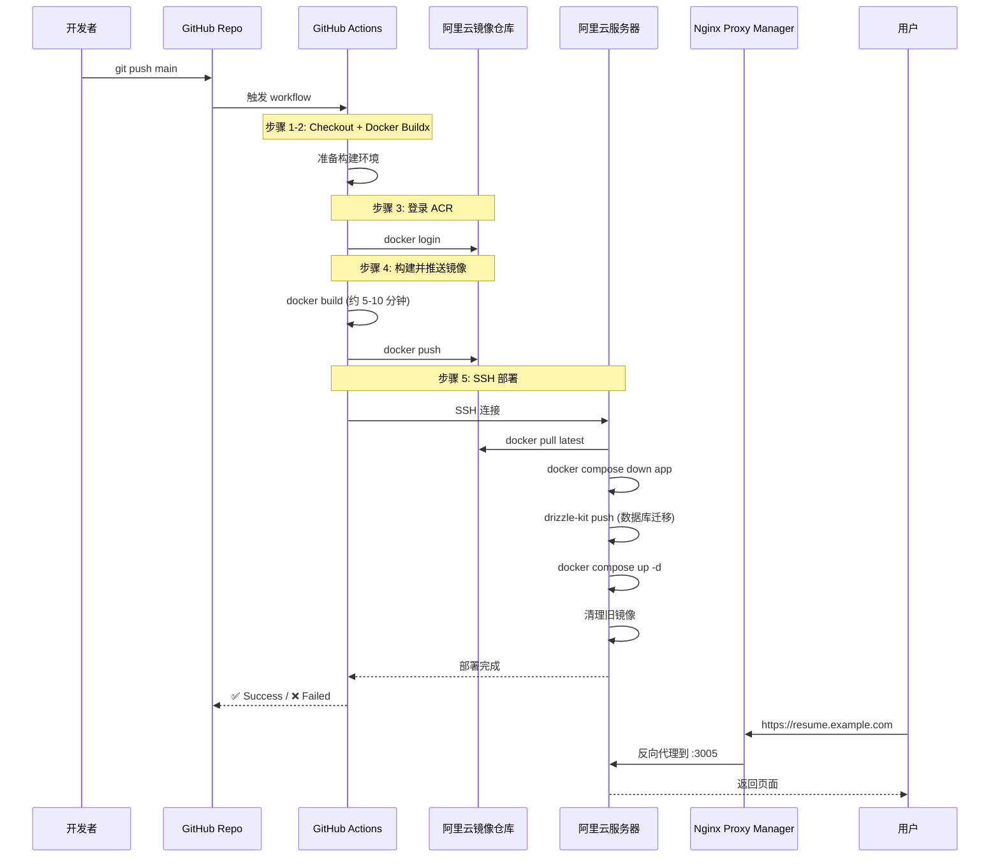

# Resume Copilot - 完整 CI/CD 部署指南

## 📋 目录

1. [架构概览](#架构概览)
2. [前置准备](#前置准备)
3. [阿里云配置](#阿里云配置)
4. [GitHub 配置](#github-配置)
5. [服务器配置](#服务器配置)
6. [CI/CD 流程](#cicd-流程)
7. [验证部署](#验证部署)
8. [故障排查](#故障排查)

---

## 架构概览

```
开发者本地
    ↓ git push main
GitHub Repository
    ↓ 触发 GitHub Actions
GitHub Actions Runner
    ├─ 1. 构建 Docker 镜像
    ├─ 2. 推送到阿里云容器镜像仓库 (ACR)
    └─ 3. SSH 到阿里云服务器部署
        ↓
阿里云 ECS 服务器
    ├─ Docker Compose
    ├─ PostgreSQL 容器 (端口 5432)
    ├─ Next.js 应用容器 (端口 3005)
    └─ Nginx Proxy Manager
        ↓
域名访问 (HTTPS)
    └─ https://resume.example.com
```

---

## 前置准备

### 1. 本地工具

- [x] Git
- [x] Node.js 20+
- [x] pnpm
- [x] Docker Desktop（可选，用于本地测试）

### 2. 账号准备

- [x] GitHub 账号
- [x] 阿里云账号
- [x] 域名（可选，用于 HTTPS）

---

## 阿里云配置

### 1️⃣ 购买 ECS 服务器

**推荐配置：**

- CPU: 2 核及以上
- 内存: 4GB 及以上
- 系统: Ubuntu 22.04 / CentOS 8
- 带宽: 3 Mbps 及以上

**重要：** 记录以下信息

- 公网 IP: `47.xxx.xxx.xxx`
- SSH 端口: `22`（默认）
- Root 密码或密钥

---

### 2️⃣ 配置安全组

**进入阿里云控制台 → ECS → 网络与安全 → 安全组**

| 端口 | 协议 | 授权对象       | 说明                         |
| ---- | ---- | -------------- | ---------------------------- |
| 22   | TCP  | `0.0.0.0/0`    | SSH 登录                     |
| 80   | TCP  | `0.0.0.0/0`    | HTTP (Nginx Proxy Manager)   |
| 443  | TCP  | `0.0.0.0/0`    | HTTPS (Nginx Proxy Manager)  |
| 3005 | TCP  | `127.0.0.1/32` | 应用端口（仅本地访问）       |
| 5432 | TCP  | `127.0.0.1/32` | PostgreSQL（仅本地访问）     |
| 81   | TCP  | `0.0.0.0/0`    | Nginx Proxy Manager 管理界面 |

**安全建议：**

- ✅ 3005 和 5432 **只允许本地访问**
- ✅ 对外只开放 80、443（通过 NPM 反向代理）
- ✅ SSH 端口建议修改（可选）

---

### 3️⃣ 创建容器镜像仓库

**进入阿里云控制台 → 容器镜像服务 → 个人实例**

#### 创建命名空间

```
命名空间名称: mycompany（改成你的）
```

#### 创建镜像仓库

```
仓库名称: resume-copilot
命名空间: mycompany
仓库类型: 私有
代码源: 本地仓库
```

#### 获取访问凭证

```
控制台 → 访问凭证 → 设置固定密码

记录以下信息：
- 仓库地址: registry.cn-hangzhou.aliyuncs.com/mycompany
- 用户名: 你的阿里云账号ID
- 密码: 你设置的固定密码
```

---

### 4️⃣ 域名解析（可选）

**如果有域名（推荐）：**

**进入域名服务商控制台 → DNS 解析**

| 记录类型 | 主机记录    | 记录值        | TTL |
| -------- | ----------- | ------------- | --- |
| A        | @ 或 resume | 你的服务器 IP | 600 |

**示例：**

```
resume.example.com  →  A  →  47.xxx.xxx.xxx
```

**等待 DNS 生效（5-10 分钟）**

```bash
# 验证域名解析
ping resume.example.com
```

---

## GitHub 配置

### 1️⃣ 创建 GitHub Secrets

**进入 GitHub 仓库 → Settings → Secrets and variables → Actions → New repository secret**

| Secret Name                | 值                                            | 说明                 |
| -------------------------- | --------------------------------------------- | -------------------- |
| `ALIYUN_REGISTRY`          | `registry.cn-hangzhou.aliyuncs.com/mycompany` | 镜像仓库地址         |
| `ALIYUN_REGISTRY_USERNAME` | `xxxxx`                                       | 镜像仓库用户名       |
| `ALIYUN_REGISTRY_PASSWORD` | `xxxxx`                                       | 镜像仓库密码         |
| `ALIYUN_HOST`              | `47.xxx.xxx.xxx`                              | 服务器公网 IP        |
| `ALIYUN_SSH_USER`          | `root`                                        | SSH 登录用户         |
| `ALIYUN_SSH_PASSWORD`      | `xxxxx`                                       | SSH 密码（或用私钥） |
| `ALIYUN_SSH_PORT`          | `22`                                          | SSH 端口（可选）     |
| `ALIYUN_APP_DIR`           | `/opt/resume-copilot`                         | 应用部署目录         |

**SSH 认证方式（二选一）：**

- **方式 1（推荐）：** 设置 `ALIYUN_SSH_KEY`（SSH 私钥）
- **方式 2：** 设置 `ALIYUN_SSH_PASSWORD`（SSH 密码）

---

### 2️⃣ GitHub Actions 工作流

**文件：** `.github/workflows/deploy.yml`

**触发条件：**

- 推送到 `main` 分支
- 手动触发（workflow_dispatch）

**执行步骤：**

1. ✅ Checkout 代码
2. ✅ 设置 Docker Buildx
3. ✅ 登录阿里云容器镜像仓库
4. ✅ 构建并推送 Docker 镜像
5. ✅ SSH 到服务器执行部署脚本
6. ✅ 通知部署状态

---

## 服务器配置

### 1️⃣ 初始化服务器

**SSH 登录服务器：**

```bash
ssh root@your-server-ip
```

**安装 Docker：**

```bash
curl -fsSL https://get.docker.com | sh
systemctl enable docker
systemctl start docker
docker --version
```

**安装 Docker Compose：**

```bash
curl -L "https://github.com/docker/compose/releases/latest/download/docker-compose-$(uname -s)-$(uname -m)" -o /usr/local/bin/docker-compose
chmod +x /usr/local/bin/docker-compose
docker-compose --version
```

---

### 2️⃣ 创建项目目录

```bash
mkdir -p /opt/resume-copilot
cd /opt/resume-copilot
```

---

### 3️⃣ 创建配置文件

#### docker-compose.prod.yml

**从 GitHub 下载或手动创建：**

```bash
curl -O https://raw.githubusercontent.com/your-username/resume-copilot/main/docker-compose.prod.yml
```

**关键配置：**

```yaml
services:
  postgres:
    ports:
      - '5432:5432' # 数据库端口

  app:
    ports:
      - '3005:3000' # 映射到 3005（避免冲突）
    environment:
      DATABASE_URL: postgresql://...
      BETTER_AUTH_SECRET: ${BETTER_AUTH_SECRET}
      BETTER_AUTH_URL: ${BETTER_AUTH_URL}
```

---

#### .env 文件

**创建环境变量文件：**

```bash
cat > .env << 'EOF'
# Database
DB_USER=resume
DB_PASSWORD=YourSecurePassword123
DB_NAME=resume_copilot

# Better Auth
BETTER_AUTH_SECRET=abc123xyz...  # openssl rand -base64 32
BETTER_AUTH_URL=https://resume.example.com

# Next.js
NODE_ENV=production
PORT=3000

# Puppeteer
PUPPETEER_EXECUTABLE_PATH=/usr/bin/chromium-browser
PUPPETEER_SKIP_CHROMIUM_DOWNLOAD=true
EOF
```

**生成 BETTER_AUTH_SECRET：**

```bash
openssl rand -base64 32
```

---

### 4️⃣ 配置防火墙

**Ubuntu (UFW):**

```bash
ufw allow 22/tcp      # SSH
ufw allow 80/tcp      # HTTP
ufw allow 443/tcp     # HTTPS
ufw allow 81/tcp      # NPM 管理界面
ufw enable
ufw status
```

**CentOS (firewalld):**

```bash
firewall-cmd --permanent --add-port=22/tcp
firewall-cmd --permanent --add-port=80/tcp
firewall-cmd --permanent --add-port=443/tcp
firewall-cmd --permanent --add-port=81/tcp
firewall-cmd --reload
```

---

### 5️⃣ 配置 Nginx Proxy Manager

**安装 Nginx Proxy Manager（如果还没有）：**

```bash
# 创建 NPM 目录
mkdir -p /opt/nginx-proxy-manager
cd /opt/nginx-proxy-manager

# 创建 docker-compose.yml
cat > docker-compose.yml << 'EOF'
version: '3'
services:
  nginx-proxy-manager:
    image: jc21/nginx-proxy-manager:latest
    restart: unless-stopped
    ports:
      - '80:80'
      - '443:443'
      - '81:81'
    volumes:
      - ./data:/data
      - ./letsencrypt:/etc/letsencrypt
EOF

# 启动 NPM
docker-compose up -d
```

**访问 NPM 管理界面：**

```
http://your-server-ip:81

默认账号：
Email: admin@example.com
Password: changeme
```

**首次登录后修改密码！**

---

**配置反向代理：**

1. **登录 NPM → Proxy Hosts → Add Proxy Host**

2. **Details 选项卡：**

   ```
   Domain Names: resume.example.com
   Scheme: http
   Forward Hostname/IP: resume-copilot-app  (或 localhost)
   Forward Port: 3005
   Cache Assets: ✅
   Block Common Exploits: ✅
   Websockets Support: ✅
   ```

3. **SSL 选项卡：**

   ```
   SSL Certificate: Request a new SSL Certificate
   ✅ Force SSL
   ✅ HTTP/2 Support
   ✅ HSTS Enabled
   Email: your@email.com
   ✅ I Agree to the Let's Encrypt Terms of Service
   ```

4. **Advanced 选项卡（可选，用于 PDF 导出超时）：**

   ```nginx
   location /api/export-pdf {
       proxy_read_timeout 300s;
       proxy_connect_timeout 300s;
       proxy_send_timeout 300s;
   }
   ```

5. **Save**

---

## CI/CD 流程

### 完整部署流程



---

### 详细步骤说明

#### 1. 代码推送

```bash
git add .
git commit -m "feat: new feature"
git push origin main
```

---

#### 2. GitHub Actions 自动触发

**构建阶段（GitHub Actions Runner）：**

```bash
# 1. 检出代码
git clone https://github.com/your-username/resume-copilot

# 2. 构建镜像
docker build -t resume-copilot .

# 3. 标记镜像
docker tag resume-copilot:latest \
  registry.cn-hangzhou.aliyuncs.com/mycompany/resume-copilot:latest

# 4. 推送到 ACR
docker push registry.cn-hangzhou.aliyuncs.com/mycompany/resume-copilot:latest
```

---

#### 3. 服务器部署

**GitHub Actions SSH 到服务器执行：**

```bash
# 1. 进入项目目录
cd /opt/resume-copilot

# 2. 登录镜像仓库
docker login registry.cn-hangzhou.aliyuncs.com

# 3. 拉取最新镜像
docker pull registry.cn-hangzhou.aliyuncs.com/mycompany/resume-copilot:latest

# 4. 停止应用容器（保留数据库）
docker compose -f docker-compose.prod.yml down app

# 5. 运行数据库迁移
docker compose -f docker-compose.prod.yml run --rm app sh -c "npx drizzle-kit push"

# 6. 启动新版本
docker compose -f docker-compose.prod.yml up -d

# 7. 清理旧镜像
docker image prune -af --filter "until=72h"
```

---

#### 4. 服务访问链路

```
用户访问
    ↓
https://resume.example.com (域名)
    ↓
Nginx Proxy Manager (80/443)
    ↓
反向代理到 localhost:3005
    ↓
Docker 端口映射 3005 → 3000
    ↓
Next.js 应用 (容器内端口 3000)
    ↓
返回页面内容
```

---

## 验证部署

### 1️⃣ 检查容器状态

```bash
# 查看运行中的容器
docker ps

# 应该看到：
# - resume-copilot-db-prod (postgres)
# - resume-copilot-app (next.js)

# 查看容器日志
docker logs -f resume-copilot-app
```

---

### 2️⃣ 测试应用访问

```bash
# 服务器本地测试
curl http://localhost:3005

# 测试健康检查（如果有）
curl http://localhost:3005/api/health

# 测试域名访问
curl https://resume.example.com
```

---

### 3️⃣ 检查数据库

```bash
# 进入数据库容器
docker exec -it resume-copilot-db-prod psql -U resume -d resume_copilot

# 查看表
\dt

# 应该看到：user, session, account, verification

# 退出
\q
```

---

### 4️⃣ 验证 SSL 证书

```bash
# 检查证书有效期
echo | openssl s_client -servername resume.example.com -connect resume.example.com:443 2>/dev/null | openssl x509 -noout -dates
```

---

## 故障排查

### 问题 1: GitHub Actions 构建失败

**检查：**

```bash
# 查看 GitHub Actions 日志
GitHub → Actions → 选择失败的 workflow → 查看详细日志
```

**常见原因：**

- ❌ Secrets 未配置或配置错误
- ❌ 镜像仓库登录失败
- ❌ 构建超时

**解决：**

```bash
# 验证 Secrets 配置
GitHub → Settings → Secrets → 检查所有必需的 secrets

# 手动测试 ACR 登录
docker login registry.cn-hangzhou.aliyuncs.com
```

---

### 问题 2: 服务器部署失败

**检查容器日志：**

```bash
docker logs resume-copilot-app
docker logs resume-copilot-db-prod
```

**常见原因：**

- ❌ 环境变量配置错误
- ❌ 数据库连接失败
- ❌ 端口被占用

**解决：**

```bash
# 检查 .env 文件
cat /opt/resume-copilot/.env

# 检查端口占用
netstat -tulpn | grep 3005
netstat -tulpn | grep 5432

# 重启服务
docker compose -f docker-compose.prod.yml restart
```

---

### 问题 3: 域名无法访问

**检查 DNS 解析：**

```bash
dig resume.example.com
nslookup resume.example.com
```

**检查 Nginx Proxy Manager：**

```bash
# 查看 NPM 日志
docker logs -f nginx-proxy-manager

# 检查配置
# 访问 http://your-server-ip:81
# 查看 Proxy Hosts 配置是否正确
```

**检查防火墙：**

```bash
# Ubuntu
ufw status

# CentOS
firewall-cmd --list-all
```

---

### 问题 4: PDF 导出失败

**检查 Chromium：**

```bash
# 进入容器
docker exec -it resume-copilot-app sh

# 验证 Chromium
chromium-browser --version
ls -la /usr/bin/chromium-browser

# 检查环境变量
echo $PUPPETEER_EXECUTABLE_PATH
```

**检查日志：**

```bash
docker logs resume-copilot-app | grep -i "pdf\|puppeteer\|chromium"
```

---

### 问题 5: 数据库迁移失败

**手动运行迁移：**

```bash
cd /opt/resume-copilot

# 运行迁移
docker compose -f docker-compose.prod.yml run --rm app sh -c "npx drizzle-kit push"

# 如果失败，检查数据库连接
docker exec -it resume-copilot-db-prod psql -U resume -d resume_copilot
```

---

## 日常维护

### 查看日志

```bash
# 实时日志
docker compose -f docker-compose.prod.yml logs -f

# 只看应用日志
docker logs -f resume-copilot-app

# 最近 100 行
docker logs --tail 100 resume-copilot-app
```

---

### 手动部署

```bash
cd /opt/resume-copilot

# 拉取最新镜像
docker compose -f docker-compose.prod.yml pull

# 重启服务
docker compose -f docker-compose.prod.yml up -d

# 查看状态
docker compose -f docker-compose.prod.yml ps
```

---

### 数据库备份

```bash
# 创建备份脚本
cat > /opt/backup-db.sh << 'EOF'
#!/bin/bash
BACKUP_DIR="/opt/backups"
mkdir -p $BACKUP_DIR
docker exec resume-copilot-db-prod pg_dump -U resume resume_copilot | gzip > $BACKUP_DIR/backup-$(date +%Y%m%d-%H%M%S).sql.gz
find $BACKUP_DIR -type f -mtime +30 -delete
EOF

chmod +x /opt/backup-db.sh

# 添加到 crontab（每天凌晨 2 点）
(crontab -l 2>/dev/null; echo "0 2 * * * /opt/backup-db.sh") | crontab -
```

---

### 更新 SSL 证书

**Let's Encrypt 证书会自动续期，无需手动操作。**

检查续期状态：

```bash
# 查看 NPM 日志
docker logs nginx-proxy-manager | grep -i "renew\|certificate"
```

---

## 安全建议

### 1. 服务器安全

- ✅ 修改 SSH 默认端口
- ✅ 禁用 root SSH 登录（创建普通用户 + sudo）
- ✅ 配置 fail2ban 防止暴力破解
- ✅ 定期更新系统和 Docker

### 2. 应用安全

- ✅ 使用强密码（数据库、Better Auth Secret）
- ✅ 定期备份数据库
- ✅ 监控应用日志
- ✅ 设置 rate limiting（防止 API 滥用）

### 3. 网络安全

- ✅ 只对外开放必要端口（80、443）
- ✅ 3005、5432 仅本地访问
- ✅ 使用 HTTPS（Let's Encrypt）
- ✅ 启用 HSTS、CSP 等安全头

---

## 总结

### CI/CD 流程总结

| 阶段           | 工具                | 耗时         | 说明              |
| -------------- | ------------------- | ------------ | ----------------- |
| **代码推送**   | Git                 | 1s           | `git push main`   |
| **触发构建**   | GitHub Actions      | 1s           | 自动触发 workflow |
| **构建镜像**   | Docker              | 5-10min      | 多阶段构建        |
| **推送镜像**   | ACR                 | 1-2min       | 上传到阿里云      |
| **SSH 部署**   | appleboy/ssh-action | 1min         | 远程执行命令      |
| **拉取镜像**   | Docker              | 10-30s       | 从 ACR 下载       |
| **数据库迁移** | Drizzle Kit         | 5-10s        | 同步 schema       |
| **启动容器**   | Docker Compose      | 10s          | 启动新版本        |
| **总耗时**     | -                   | **8-15分钟** | 全自动            |

---

### 配置清单

#### GitHub Secrets (8 个)

- [x] `ALIYUN_REGISTRY`
- [x] `ALIYUN_REGISTRY_USERNAME`
- [x] `ALIYUN_REGISTRY_PASSWORD`
- [x] `ALIYUN_HOST`
- [x] `ALIYUN_SSH_USER`
- [x] `ALIYUN_SSH_PASSWORD` 或 `ALIYUN_SSH_KEY`
- [x] `ALIYUN_SSH_PORT`（可选）
- [x] `ALIYUN_APP_DIR`

#### 阿里云配置

- [x] ECS 服务器
- [x] 安全组规则
- [x] 容器镜像仓库
- [x] 域名解析（可选）

#### 服务器配置

- [x] Docker + Docker Compose
- [x] 项目目录 `/opt/resume-copilot`
- [x] `.env` 文件
- [x] `docker-compose.prod.yml`
- [x] Nginx Proxy Manager
- [x] 防火墙规则

---

**部署完成！每次推送代码到 main 分支，应用会自动部署到生产环境。** 🎉
